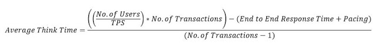

# think time

[What is Think Time in Performance Testing?](https://perfmatrix.blogspot.com/2017/03/think-time.html)


Think time defines the time between two actions of a user. These actions may be navigating the pages, click on the submit button, type keyword and then click "Search" button etc. Still not clear... Ooppppssss?

Let's take one example, you want to buy a Titan watch from Amazon online shopping portal. 
You liked one watch from the catalogue and you clicked on its image. 

Before adding into the cart you want to read its "Product Specification" 
which is on the same page. It took 20 seconds for you to read full specifications 
and decided to buy this watch then you clicked "Add to Cart" button. 

So, from the moment when this page was loaded until you read the specification 
and clicked "Add to Cart" button would be "Think Time" means 20 seconds. See below GIF


How can we calculate think time?
In the real world, think time is totally dependent on user's actions. It may be less than a second for a techie guy while more than a minute for a new user. So, instead of worrying about think time, better you go for an average think time value and use this value between two transactions. Generally, a user spends an average 8 seconds on a website page with average content over there, so you take any figure between 5 to 10 second as a think time. 

You can also calculate think time using below formula (provided that you should have all the required parameters)



Example: If you have - 
- No. of users = 6
- End to End Response Time = 25 seconds
- TPS (Transaction per second) = 0.5
- Pacing = 15 seconds
- No. of Transactions = 5
- Total Think Time = 20 seconds
Average think time would be 5 seconds

You can also verify like this:

- Transaction 1 (Home Page)- 3 seconds
    - Think Time  - 5 seconds
- Transaction 2 (Log-in) - 4 seconds
    - Think Time  - 5 seconds
- Transaction 3 (Search) - 10 seconds
    - Think Time  - 5 seconds
- Transaction 4 (Add To Cart) - 5 seconds
    - Think Time  - 5 seconds
- Transaction 5 (Log-out) - 3 seconds
    - Pacing  - 15 Seconds

Refer [Think Time Calculator](http://perfmatrix.blogspot.com/2016/11/think-time-calculator.html) to calculate think time.


[How much think time](https://octoperf.com/blog/2017/03/15/think-time/)

> `Think time per transaction = (Total expected time - Total response time) / Number of transactions`

[How to benchmark apache with delays?](https://stackoverflow.com/questions/978142/how-to-benchmark-apache-with-delays)

I just love [The Grinder](http://grinder.sourceforge.net/g3/features.html), a fully programmable testing tool. Sadly you can't run it completely from the command line, but I'd really give it a try if I were you.

Failing that, you have [httperf](http://www.hpl.hp.com/research/linux/httperf) which is indeed command line and supports "user sessions" (that is, delays) and many other options.


You could run ab through watch to delay the repeated access, but you're not going to be able to use the report summary for much.

`watch -n 1 ab -n 3 http://serverfault.com/`

Or run it through curl instead of ab

`watch -n 0.4 curl http://serverfault.com/`


[siege](https://github.com/JoeDog/siege)

```bash
http-upload-benchmark on  master [?] via 🐹 v1.15 took 2s 
🕙[2020-08-19 09:36:26.534] ❯ siege -h                                 
SIEGE 4.0.7
Usage: siege [options]
       siege [options] URL
       siege -g URL
Options:
  -V, --version             VERSION, prints the version number.
  -h, --help                HELP, prints this section.
  -C, --config              CONFIGURATION, show the current config.
  -v, --verbose             VERBOSE, prints notification to screen.
  -q, --quiet               QUIET turns verbose off and suppresses output.
  -g, --get                 GET, pull down HTTP headers and display the
                            transaction. Great for application debugging.
  -p, --print               PRINT, like GET only it prints the entire page.
  -c, --concurrent=NUM      CONCURRENT users, default is 10
  -r, --reps=NUM            REPS, number of times to run the test.
  -t, --time=NUMm           TIMED testing where "m" is modifier S, M, or H
                            ex: --time=1H, one hour test.
  -d, --delay=NUM           Time DELAY, random delay before each request
  -b, --benchmark           BENCHMARK: no delays between requests.
  -i, --internet            INTERNET user simulation, hits URLs randomly.
  -f, --file=FILE           FILE, select a specific URLS FILE.
  -R, --rc=FILE             RC, specify an siegerc file
  -l, --log[=FILE]          LOG to FILE. If FILE is not specified, the
                            default is used: PREFIX/var/siege.log
  -m, --mark="text"         MARK, mark the log file with a string.
                            between .001 and NUM. (NOT COUNTED IN STATS)
  -H, --header="text"       Add a header to request (can be many)
  -A, --user-agent="text"   Sets User-Agent in request
  -T, --content-type="text" Sets Content-Type in request
  -j, --json-output         JSON OUTPUT, print final stats to stdout as JSON
      --no-parser           NO PARSER, turn off the HTML page parser
      --no-follow           NO FOLLOW, do not follow HTTP redirects

Copyright (C) 2018 by Jeffrey Fulmer, et al.
This is free software; see the source for copying conditions.
There is NO warranty; not even for MERCHANTABILITY or FITNESS
FOR A PARTICULAR PURPOSE.
```


